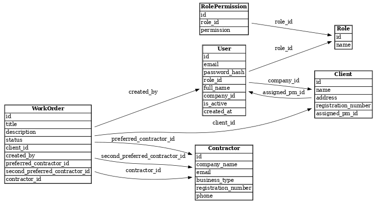

# Works Logix

Works Logix is a role-based property maintenance management platform designed for property management companies and contractors. The platform allows Admins to manage clients and users, Property Managers to create and manage work orders, and Contractors to view and update assigned work.

## Features

- Secure login and role-based access (Admin, Property Manager, Contractor)
- Create and manage work orders
- Assign preferred and secondary contractors
- Contractors can accept/reject work orders and upload completion files
- Auto-routing of work orders based on contractor availability
- PostgreSQL database with normalized schema
- Deployed live via Render

## Live Demo

[View Live App on Render](https://works-logix.onrender.com)

[GitHub Repository](https://github.com/gustavowmarques/works-logix.git)

## Entity Relationship Diagram (ERD)

The ERD below outlines the core tables and relationships between Users, Clients, Work Orders, and Roles in the system:



## Technologies Used

- Python (Flask)
- PostgreSQL (via SQLAlchemy)
- HTML/CSS (Bootstrap 5)
- Flask-Login for user sessions
- Werkzeug for password hashing
- Render for deployment

## Roles & Permissions

| Role            | Permissions                                                        |
|-----------------|---------------------------------------------------------------------|
| Admin           | Manage users and clients, full access                              |
| Property Manager| Create work orders, view only their orders                         |
| Contractor      | View & update assigned work orders, upload media, mark complete    |

## File Structure

- `app/`
  - `models.py` – SQLAlchemy models
  - `auth.py` – User authentication
  - `manager_routes.py`, `contractor_routes.py`, `admin_routes.py` – Route logic
  - `templates/` – HTML templates per role
- `migrations/` – Flask-Migrate DB migrations
- `run.py` – Entry point
- `README.md` – This file

## Setup Instructions

1. Clone the repo:
   ```bash
   git clone https://github.com/gustavowmarques/works-logix.git
   cd works-logix
   ```

2. Create and activate virtual environment:
   ```bash
   python -m venv venv
   venv\Scripts\activate   # On Windows
   ```

3. Install dependencies:
   ```bash
   pip install -r requirements.txt
   ```

4. Set environment variables in a `.env` file (example below):
   ```env
   FLASK_APP=run.py
   FLASK_ENV=development
   SECRET_KEY=your_secret
   DATABASE_URL=your_postgres_connection_string
   ```

5. Run the app:
   ```bash
   flask run
   ```

## Comments and Documentation

All Python route and model files are commented to explain key functionality, relationships, and access control logic to demonstrate understanding of the codebase.

## Author

Created by Gustavo Marques for the UCD Full Stack Development Program - Database Module Assignment.